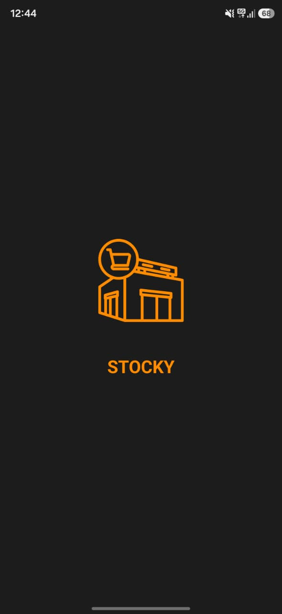
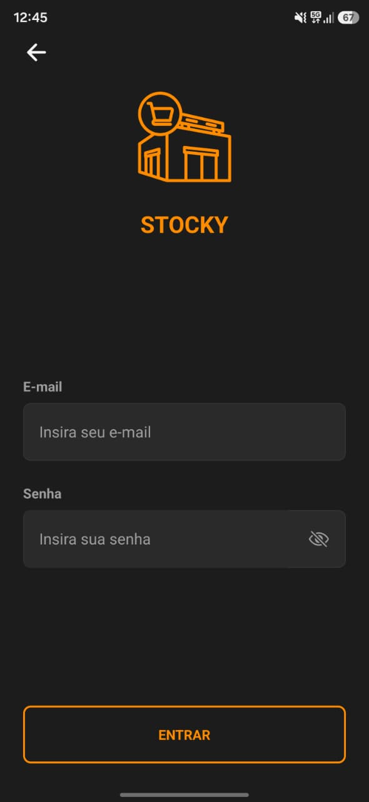
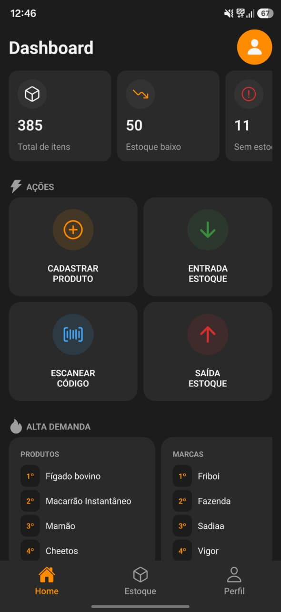
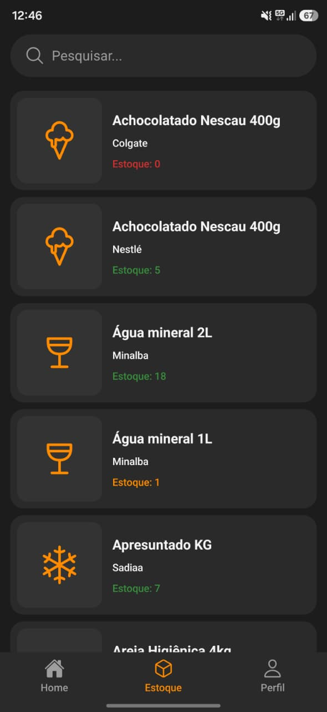
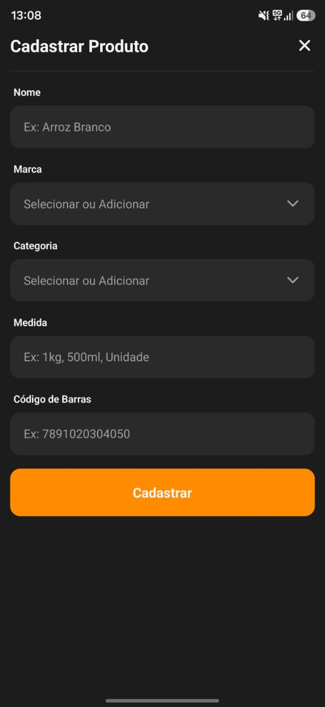
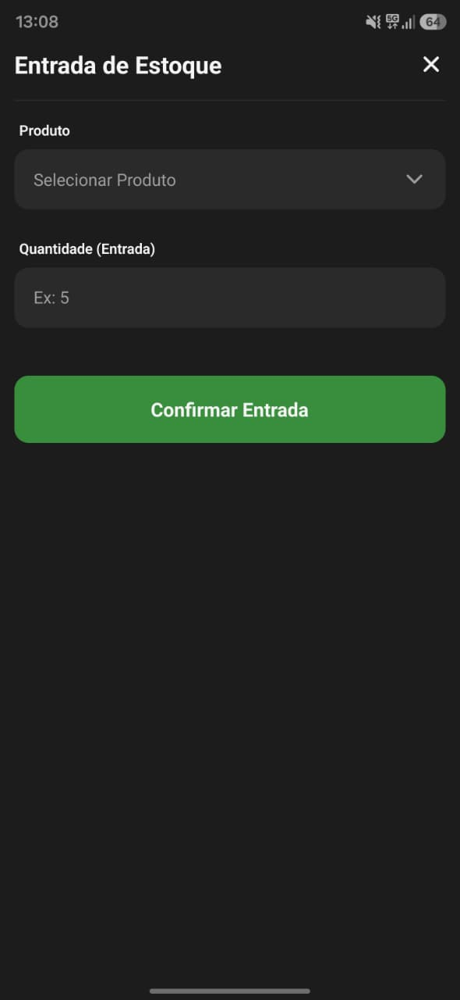
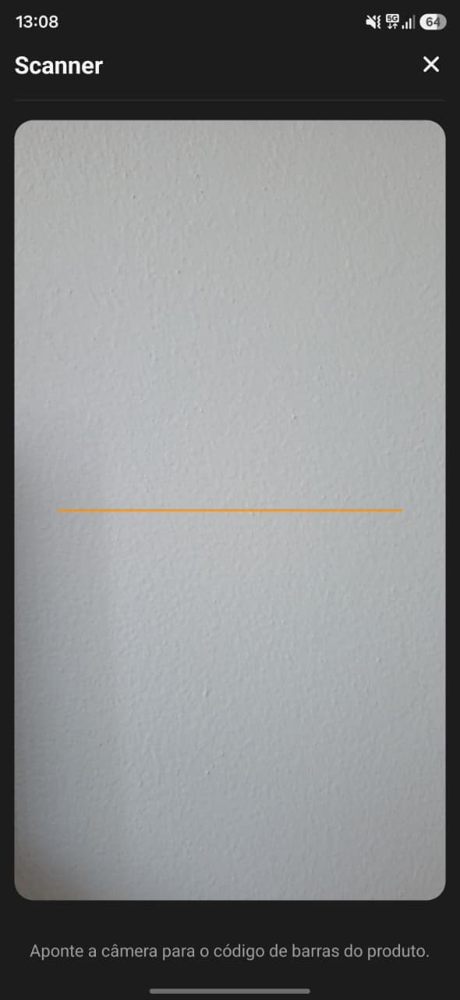
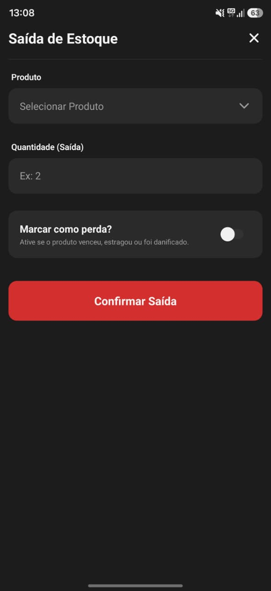
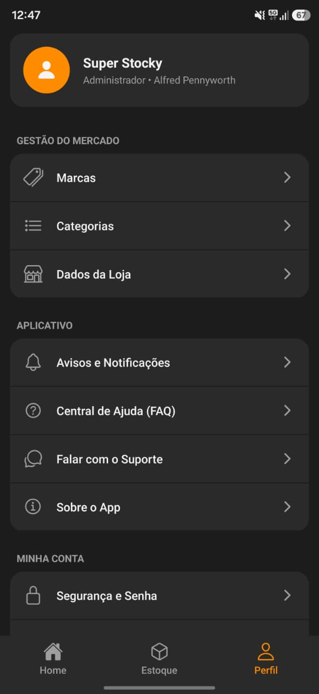
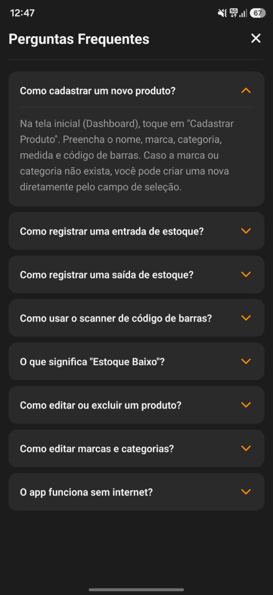

# 📦 Stocky — Gerenciador de Estoque Mobile

Aplicativo mobile de controle de estoque desenvolvido para micro e pequenos empreendedores. O Stocky oferece uma solução simples, acessível e eficiente para gerenciar produtos, registrar movimentações e acompanhar indicadores em tempo real.

---

## 📱 Telas

### Splash Screen

Tela de carregamento com a identidade visual do Stocky — logo e nome do app em destaque sobre fundo escuro.

---

### Login

Autenticação via e-mail e senha com toggle de visibilidade da senha. Acesso seguro à conta do estabelecimento.

---

### Dashboard

 

Painel principal com indicadores em tempo real: total de itens, estoque baixo e produtos sem estoque. Acesso rápido às principais ações — cadastrar produto, entrada, saída e scanner. Exibe também ranking de produtos e marcas com maior demanda e histórico de movimentações recentes.

---

### Estoque

Listagem completa dos produtos cadastrados com busca em tempo real. Cada item exibe nome, marca, categoria e quantidade em estoque — com indicação visual em vermelho para estoque zerado e laranja para estoque baixo.

---

### Cadastrar Produto

Formulário de cadastro com campos para nome, marca, categoria, medida e código de barras. Marcas e categorias podem ser selecionadas ou criadas diretamente pelo campo de seleção.

---

### Entrada de Estoque

Registro de entrada de mercadoria com seleção do produto e quantidade. Confirmação com um toque, atualizando o estoque em tempo real.

---

### Saída de Estoque

Registro de saída com opção de marcar o item como perda — útil para produtos vencidos, estragados ou danificados. O histórico é preservado mesmo após exclusão do produto.

---

### Scanner de Código de Barras

Scanner EAN integrado que utiliza a câmera do dispositivo para identificar produtos pelo código de barras, agilizando entradas, saídas e buscas no estoque.

---

### Perfil e Configurações

Área do administrador com acesso à gestão de marcas, categorias e dados da loja. Também centraliza notificações, suporte, FAQ e configurações de segurança.

---

### Perguntas Frequentes

Central de ajuda com acordeão de perguntas e respostas sobre as principais funcionalidades do app.

---

## 🛠️ Stack

- **React Native** + **Expo**
- **TypeScript**
- **Supabase** (banco de dados, autenticação e realtime)
- **Expo Camera** (scanner de código de barras)
- **Context API** (gerenciamento de estado)

---

## ✨ Funcionalidades

- ✅ Autenticação segura
- ✅ Dashboard com indicadores em tempo real
- ✅ CRUD completo de produtos, marcas e categorias
- ✅ Entrada e saída de estoque com histórico
- ✅ Marcação de perdas
- ✅ Scanner de código de barras EAN
- ✅ Ranking de produtos e marcas mais movimentados
- ✅ Histórico preservado após exclusão de produtos
- ✅ Central de ajuda (FAQ)

---

## 👨‍💻 Desenvolvido por

**Leonardo Roriz Bessa**  
